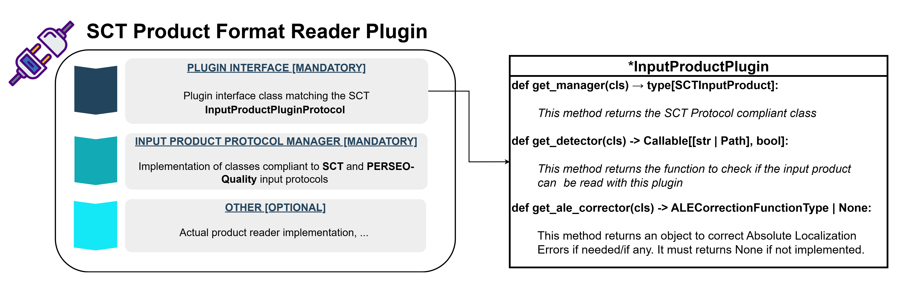
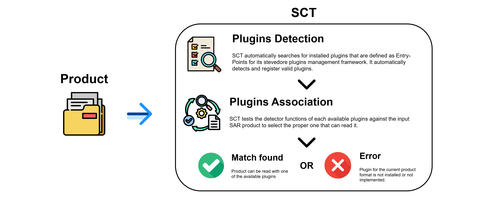

# Product Format Plugins

The SCT framework is designed to be **analysis-agnostic** with respect to input product formats.  
Different satellite and sensors products may have varying data formats and conventions.  
To decouple the analysis code from the input data type, we use a **plugin-based architecture**.

This allows:

- New input product formats to be added without modifying the core analysis code.
- Analyses to interact with a unified interface, regardless of the actual product type.
- Easy distribution of input product plugins as independent packages.

Several plugins for some of the most common SAR products and sensors are already available.

!!! note "Supported Products"

    To use the functionalities of SCT for a specific product, it is necessary to install, in addition to SCT,
    the corresponding plugin. Plugins are Python packages that can be discovered automatically by SCT once installed.

## Architecture

<figure markdown="span">
    { width="850" }
    <figcaption>Schematics of the plugin architecture.</figcaption>
</figure>

The plugin system has been implemented with the following architecture:

1. **Protocol Layer** (``sct.plugins.input_products_protocols``)

    - Defines the **protocols** (interfaces) that all input product plugins must implement.
    - Contains **core abstractions** such as ``InputProductPluginProtocol`` and ``AbsoluteLocalizationErrorCorrector``.
    - No knowledge of how plugins are loaded or installed.

2. **Loader Layer** (``sct.plugins.loader``)

    - Responsible for **discovering and loading plugins**.
    - Uses ``stevedore`` to dynamically load all installed plugins in the ``sct.input_products`` namespace.
    - Isolated from analysis logic.

3. **Registry Layer** (``sct.plugins.__init__``)

    - Provides a **registry** of loaded plugins.
    - Analysis code interacts only with the registry, never with plugin loading mechanisms.

4. **Plugin Packages**

    - Each plugin lives in a **separate installable package**.
    - Declares an **entry point** in ``pyproject.toml`` using the ``sct.input_products`` namespace.
    - Implements the ``InputProductPluginProtocol`` protocol.

## Plugin Discovery with Stevedore

<figure markdown="span">
    { width="850" }
    <figcaption>Automatic plugin discovery mechanism.</figcaption>
</figure>

Plugins are discovered dynamically using Stevedore:

```python title="Discovery Mechanism"
from stevedore import ExtensionManager

manager = ExtensionManager(
    namespace="sct.input_products",
    invoke_on_load=True,
    on_load_failure_callback=_on_load_failure
)
```

Namespace must match the entry point group defined in each plugin's ``pyproject.toml``.

## Benefits

- **Extensibility**: New input products are supported via independent packages.
- **Decoupling**: Core analysis logic does not depend on plugin implementation.
- **Testability**: Plugins can be mocked or substituted without touching the core.
- **Dynamic discovery**: Plugins are discovered at runtime via entry points, no hard-coded imports required.

## Installation and Usage

To install a specific plugin for SCT using ``pip``:

```bash title="Installing a Plugin"
pip install <name_of_sct_plugin>
```

Then the software can discover automatically all the installed plugins and perform analyses on products corresponding to
the installed plugins.

## Product Format Plugins Documentation

A dedicated documentation site for SCT Input Product Plugins has been created to gather all plugin python packages developed
and all the supported sensors and formats.

> :lucide-circle-chevron-right: Refer to the [official plugins documentation](https://aresys-srl.github.io/sct_plugins/) for further information.
