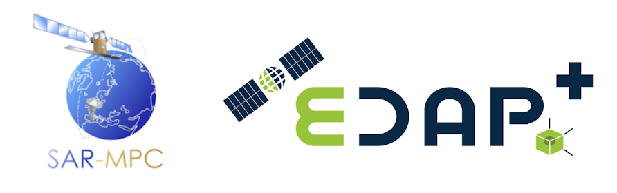
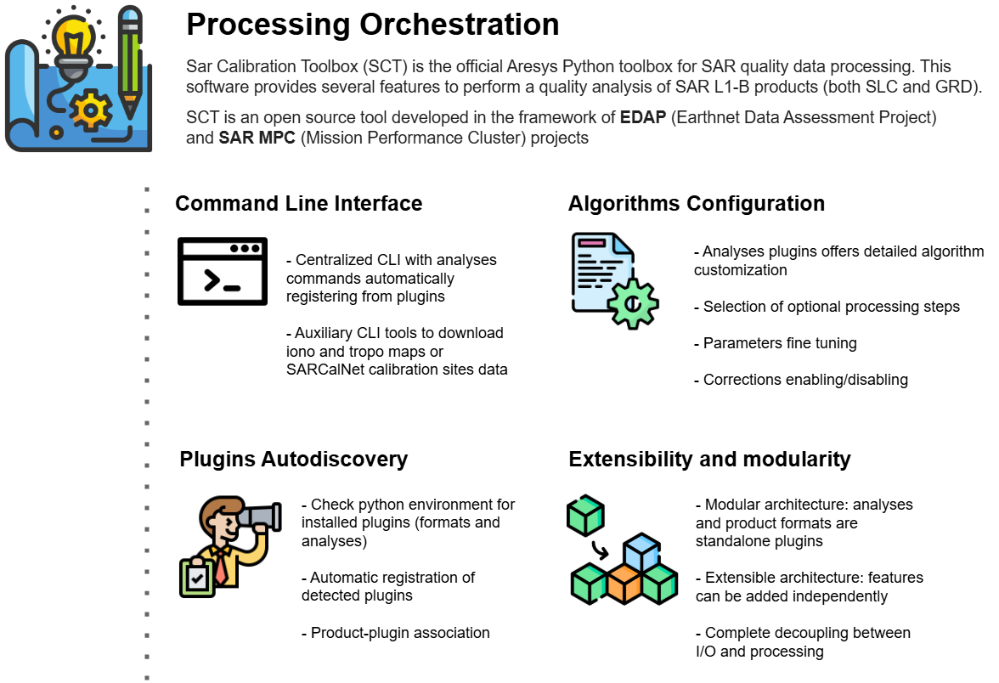
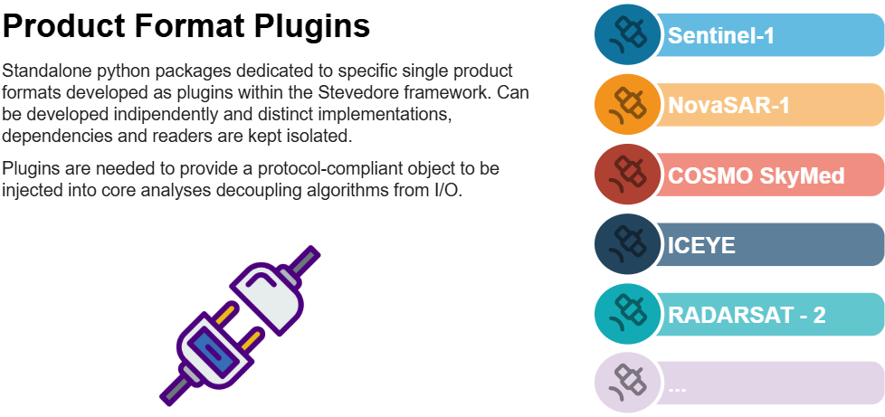
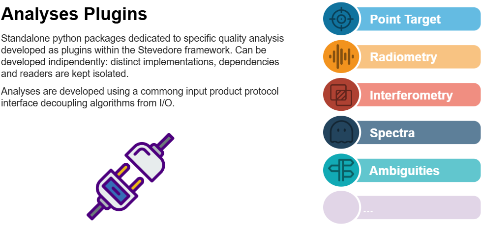

# SAR Calibration Toolbox (SCT)

Sar Calibration Toolbox (SCT) is the official Aresys Python toolbox for SAR quality data processing.
This software provides several features to perform a quality analysis of SAR L1-B products (both SLC and GRD).

SCT is an open source tool developed in the framework of **EDAP** (Earthnet Data Assessment Project) and **SAR MPC**
(Mission Performance Cluster) projects. For more details please visit:

- [Earthnet Data Assessment Project (EDAP+)](https://earth.esa.int/eogateway/activities/edap)
- [EDAP+ SAR missions](https://earth.esa.int/eogateway/activities/edap/sar-missions)
- [SAR MPC](https://sar-mpc.eu/)

<figure markdown="span">
    { width="850" }
    <figcaption>Projects that sponsored the development of SCT.</figcaption>
</figure>

## Software Architecture

Here is a brief overview of the software architecture of SCT:

<figure markdown="span">
    { width="800" }
    <figcaption>Schematics of the software architecture.</figcaption>
</figure>

The SCT framework is designed to be **analysis-agnostic** with respect to input product formats. Product format plugins
are used to decouple the analysis code from the input data type, allowing new input product formats to be added without
modifying the core analysis code.

<figure markdown="span">
    { width="800" }
    <figcaption>Product format plugins.</figcaption>
</figure>

Same goes for the **product-agnostic** quality analyses. Analyses plugins are used to decouple the analysis code from
the orchestration and product format I/O, allowing new analyses to be added without modifying the core software.

<figure markdown="span">
    { width="800" }
    <figcaption>Quality analyses plugins.</figcaption>
</figure>

## Supported Missions and Products

This tool is designed to be input product agnostic, and can be used to perform a quality analysis on any
SAR L1-A/B product (among those supported) in a standardized way.
To check if the mission or product type to be analyzed is currently supported by this tool, please refer
to the [SCT Product Format Plugins documentation](https://opensource.aresys.it/sct_plugins/).

## Available Quality Analyses

Several analyses to assess quality of SAR L1A/B products have been developed and are available as SCT plugins. They can
be installed separately or bundled together with the main software using the ``[recommended]`` [optional dependency group
installation](install.md).

-   :material-clock-fast:{ .lg .middle } __Quick Setup__

    ---

    Install SCT via ``pip`` and get started quickly.

    [:octicons-arrow-right-24: Install](install.md)

-   :fontawesome-brands-python:{ .lg .middle } __API Documentation__

    ---

    Full documentation of modules, functions and objects
    available in SCT, generated from docstrings.

    [:octicons-arrow-right-24: API Documentation](API/reference/index.md)

-   :lucide-flask-conical:{ .lg .middle } __Analyses Plugins__

    ---

    Available quality analyses plugins, with detailed documentation on
    how to install and use them.

    [:octicons-arrow-right-24: Plugins](plugins/analysis_plugins.md)

-   :lucide-unplug:{ .lg .middle } __Product Format Plugins__

    ---

    Supported input product plugins, with detailed documentation on
    how to install and use them.

    [:octicons-arrow-right-24: Plugins](plugins/format_plugins.md)

