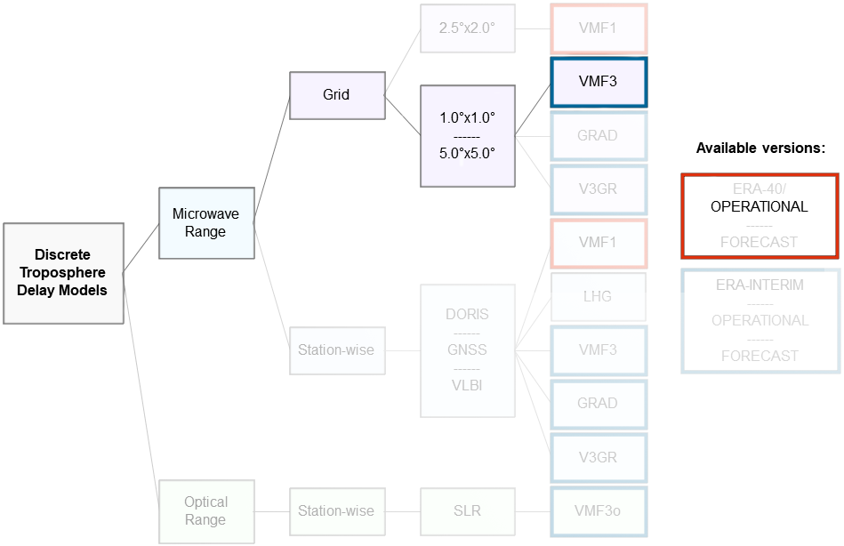

.. _sct_pta_corrections:

Corrections for Point Target Analysis
=====================================

Point Target Analysis can be performed applying several corrections to input data in order to take into account the different
phenomena that can affect the results, in particular those regarding **Localization Errors**.

SCT implements optional corrections that can be enabled or disabled from the configuration file to fully customize the analysis
flow. Here are the available options that the user can access:

- **Solid Earth Tides Displacement**: computing solid tides for a specific ground point at a given time
- **Plate Tectonics Displacement**: computing the plate tectonic movement using provided drift velocities or an internal model
- **Ionospheric Delay**: computing signal delay due to ionospheric effects from external TEC maps
- **Tropospheric Delay**: computing signal delay due to tropospheric effects from external maps
- **Sensor specific processing corrections**: some sensors need specific corrections, i.e. Sentinel-1
- **ETAD Range and Azimuth corrections**: if an ETAD product is provided, range and azimuth corrections can be applied

In the following sections, each correction is described for further clarifications.

Geodynamics Displacements
^^^^^^^^^^^^^^^^^^^^^^^^^

The following corrections are due to geodynamics phenomena and affect the coordinates of the point targets located everywhere
on Earth. They are applied, if needed, directly on calibration target ECEF coordinates to take into account the position displacement
at the moment of the SAR acquisition time.
In particular, solid tides are evaluated at the acquisition mid-swath time while plate tectonics is computed using the
time delta between the acquisition time and the target coordinates measurement date.

Solid Earth Tides
~~~~~~~~~~~~~~~~~

Solid Earth Tides (SET) are computed using a wrapper of the Fortran **Solid** program written by Dennis Milbert from source code
provided by Professor V. Dehant [#]_. This correction *does not take into account* ocean loading, atmospheric loading, or
deformation due to polar motion.

.. note::

   SCT uses an internal C++ pre-compiled library wrapping the original Fortran tool. This means that there is no need of
   a any type of compiler or Fortran dependency.

This correction is **enabled by default**.

Plate Tectonics
~~~~~~~~~~~~~~~

Plate tectonics displacements are computed using an internal model based on *ITRF2014 plate motion model* [#]_. For more
accurate results, drift velocities measured directly during point targets measurement campaigns should be used.

These velocities can also be provided as inputs when using an external .csv source for point target locations that is compliant
to the template provided.

This correction is **enabled by default**.

Atmospheric Delays
^^^^^^^^^^^^^^^^^^

The following corrections are due to atmospheric phenomena affecting the signal emitted and received from the sensor that
passes through the ionosphere and troposphere, causing delays in transmission and reception.
Atmospheric delays are applied to out-of-the-box **Absolute Localization Errors** measurements both along range and azimuth
directions.

All the following atmospheric delays corrections affects ALE along **range** direction.

Ionospheric Delay
~~~~~~~~~~~~~~~~~

Signal delay caused by ionosphere crossing is estimated interpolating the VTEC (Vertical Total Electron Content) maps in
IONEX (*ION* onosphere *EX* change) format generated from NASA GNSS-CDDIS data and analyzed from specific analysis center [#]_.
This map must be provided as an input when this correction is enabled via the configuration file.
The analysis center of the maps should be specified too. It's also possible to change the method used to compute the incidence angles
to detect the pierce point using the configuration file.

The map should be the closest to the acquisition time of the product to be analyzed and the exact time is automatically interpolated.

This correction is **disabled by default**.

Tropospheric Delay
~~~~~~~~~~~~~~~~~~

Signal delay caused by troposphere crossing is estimated interpolating the tropospheric products maps using Vienna Mapping
Function 3 (VMF3) model [#]_. Four maps are needed to perform the interpolation at best:

- the main file, the closest to the acquisition time hour (approximated by defect).
- the previous file (the one 6 hours before the main one).
- the two files after the main one (6 hours after and 12 hours after).

   Scheme of supported troposphere products.

These maps must be provided as an input when this correction is enabled via the configuration file. Only GRID data for VMF3
are supported: 1x1 (fine) grid is the default type of data, while 5x5 (coarse) can be provided specifying the change of grid type
in the configuration file.
Data maps must be of the **Operational (OP)** type.

This correction is **disabled by default**.

ETAD Products Corrections
^^^^^^^^^^^^^^^^^^^^^^^^^

If an ETAD product is provided for the SAR acquisition to be analyzed, the range and azimuth corrections contained in this
product are extracted and added to the output.

The corrections applied correspond to the merged ones both for azimuth and range directions.

Sensor-specific Processing Corrections
^^^^^^^^^^^^^^^^^^^^^^^^^^^^^^^^^^^^^^

It might happen that a particular sensor needs specifically designed corrections to be applied at the end of the processing
phase in order to output the correct results. These corrections are hardcoded and must be implemented and custom designed for each
sensor type.

As of now, only the following corrections have been included.

    | **Sensor**: Sentinel-1
    | **Range Corrections**: doppler shift correction
    | **Azimuth Corrections**: bistatic delay, instrument timing, FM rate shift

Footnotes
^^^^^^^^^

.. _DOI: https://doi.org/10.1093/gji/ggx136

.. [#] For more information, check the `official GitHub page of Solid project. <https://geodesyworld.github.io/SOFTS/solid.htm>`__

.. [#] Zuheir Altamimi et al., *"ITRF2014 plate motion model"*, Geophysical Journal International, 2017, DOI_

.. [#] For more information, check the `official website. <https://cddis.nasa.gov/Data_and_Derived_Products/GNSS/atmospheric_products.html>`__

.. [#] For more information, check the `CDDIS site <https://cddis.nasa.gov/archive/gnss/products/troposphere/zpd>`__ or
       the `VMF Data Server <https://vmf.geo.tuwien.ac.at/>`__
